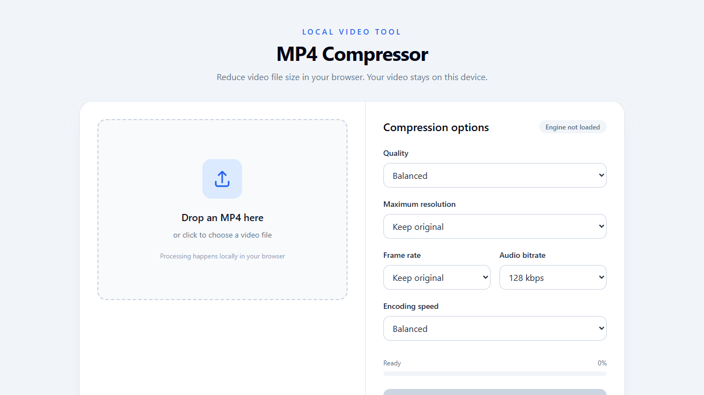
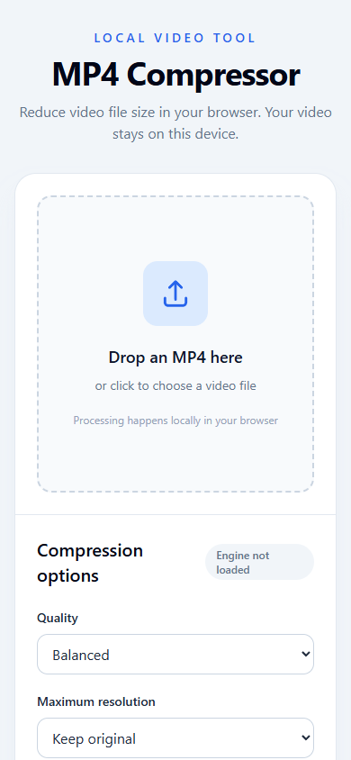

# MP4 Compressor

A browser based MP4 compressor powered by FFmpeg.wasm. Videos are selected and processed locally in the browser, then downloaded as a new MP4 file.

Live tool: [compressvideo.weiwei.website](https://compressvideo.weiwei.website)

## Features

- Drag and drop or select a video file
- H.264 MP4 output
- Quality control using CRF presets
- Maximum resolution options from 480p to 4K
- Frame rate options from 24 to 60 fps
- Audio bitrate selection or audio removal
- Fast, balanced, and smaller-file encoding presets
- Progress reporting and before/after size comparison
- No video upload to an application server

## How to use

1. Open the live tool or serve this folder from a local web server.
2. Drop an MP4 into the upload area.
3. Choose quality, resolution, frame rate, audio, and encoding speed.
4. Click **Compress video**.
5. Download the generated MP4 when processing finishes.

The first compression loads the FFmpeg.wasm engine from the pinned CDN packages. Large videos can require significant browser memory and processing time.

## Run locally

From this folder, run the included isolated development server:

```powershell
python server.py
```

Then open <http://127.0.0.1:8000/>.

## Screenshots

### Desktop



### Mobile



## Files

- `index.html` - interface and styling
- `app.js` - file handling, FFmpeg.wasm setup, compression, and download logic
- `screenshots/` - README preview images
